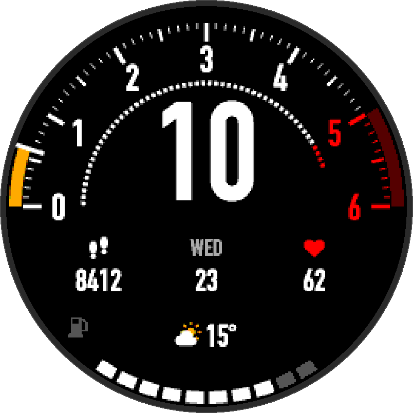

# Tachometer Watch Face

A Garmin Connect IQ watch face that reads like a car instrument cluster. The minutes are a tachometer, the hour is the gear, the seconds are a rev bar, and the battery is a fuel gauge.

<p align="center">
  
</p>

<p align="center"><sub>10:06, shown at 3× in the <a href="prototype/index.html">HTML prototype</a>. On the watch the numerals are Barlow Condensed, so the digits look slightly different.</sub></p>

Built for the fenix 7 Pro (47mm, 260×260 round MIP display). The same build also targets the other watches with a 260×260 round MIP screen: fenix 6, fenix 6 Pro, fenix 7, the fenix 7 Pro without Wi-Fi, fenix 8 Solar 47mm, fenix 9 Pro Solar 47mm, Forerunner 255, 255 Music and 955, vívoactive 4, and the Legacy First Avenger and Darth Vader editions. `manifest.xml` has the device ids. All geometry scales with the screen radius, and the bitmap fonts are generated for every screen size from 240 to 466 px, so adding other round devices is cheap.

## Status

The face runs on a real fenix 7 Pro, and its unit tests pass. Support for more round watches, MIP and AMOLED, is in progress ([spec](docs/specs/multi-device.md)). It isn't in the Connect IQ Store yet, so to use it you build it and sideload it yourself.

## The face

- **Tachometer**: a half-circle scale across the top, numbered 0 to 6. Each unit is ten minutes of the current hour, and minutes 50 to 60 are the red Redline.
- **Minute Style**: the current minute as a Needle, a Sweep (filled arc), or a Sweep + Tip. The default is Sweep + Tip.
- **Gear**: the current hour as a large number inside the Tachometer. It follows the watch's 12/24-hour setting.
- **Rev Bar**: a thin arc that fills across the current minute, one segment per second.
- **Fuel Gauge**: battery level as ten segments at the bottom of the face. The pump icon turns amber at 20% and red at 10%.
- **Slots**: four places (Left, Center, Right and Bottom) that each show one Readout: date, steps, weather, heart rate, Body Battery, sunrise/sunset, notifications, battery %, or nothing.

The full design is in [`docs/design.md`](docs/design.md), and the vocabulary is in [`CONTEXT.md`](CONTEXT.md).

## Settings

Change these in the Garmin Connect phone app, under the watch face's settings:

| Setting | Options | Default |
|---|---|---|
| Minute Style | Needle, Sweep, Sweep + Tip | Sweep + Tip |
| Always-on Rev Bar | on, off | off |
| Left / Center / Right / Bottom Slot | any Readout | Steps / Date / Heart rate / Weather |
| Weather temperature | Feels like, Actual | Feels like |

The watch's system settings control the 12/24-hour format and units.

## Building

You need:

- The [Connect IQ SDK](https://developer.garmin.com/connect-iq/sdk/), installed through the SDK Manager, with the `fenix7pro` device profile.
- A Java runtime, which `monkeyc` needs (for example `brew install openjdk`).
- A developer key. You can generate one with OpenSSL:

  ```sh
  openssl genrsa -out developer_key.pem 4096
  openssl pkcs8 -topk8 -inform PEM -outform DER -in developer_key.pem -out developer_key.der -nocrypt
  ```

  Keep the key outside the repo. `.gitignore` blocks `*.der` and `*.pem` in case one ends up inside it.

Put the SDK's `bin/` directory on your `PATH`, then run these from the repo root:

```sh
# Build and run in the simulator
monkeyc -d fenix7pro -f monkey.jungle -o bin/tachometer.prg -y /path/to/developer_key.der
monkeydo bin/tachometer.prg fenix7pro

# Run the unit tests
monkeyc -d fenix7pro -f monkey.jungle -o bin/tachometer-test.prg -y /path/to/developer_key.der -t
monkeydo bin/tachometer-test.prg fenix7pro -t
```

The Monkey C extension for VS Code works too.

### Sideloading

Connect the watch over USB and copy `bin/tachometer.prg` into `GARMIN/APPS`. On macOS the fenix 7 connects over MTP, so you'll need a tool such as [OpenMTP](https://github.com/ganeshrvel/openmtp).

The app id in `manifest.xml` is fine for sideloading. If you publish your own build to the Connect IQ Store, give it a new id.

## Project layout

```
source/             Monkey C code, one module per part of the face (Tachometer.mc, Gear.mc, ...)
                    Unit tests sit next to their module (*Test.mc)
resources/          Settings, strings, drawables and the generated bitmap fonts (the 260 px set)
resources-round-*/  The bitmap fonts for the other screen sizes, picked by the build per watch
assets/fonts/       Source TTF for the bitmap fonts
tools/              gen_bitmap_font.py, which regenerates every font set from assets/fonts
prototype/          HTML prototype of the face, used as the geometry reference for the port
docs/               Design notes and the implementation tickets
```

To regenerate the bitmap fonts after changing sizes or glyphs, install Pillow (`pip install Pillow`) and run `tools/gen_bitmap_font.py`. It writes one set per screen size: the 260 px set to `resources/fonts/`, and the others to `resources-round-WxH/fonts/`.

## License

The code is under the [MIT License](LICENSE).

The numeral font is [Barlow Condensed](https://github.com/jpt/barlow) Bold, under the [SIL Open Font License 1.1](assets/fonts/OFL.txt). The OFL also covers the bitmap fonts in `resources/fonts/` and `resources-round-*/fonts/`, which are generated from it.
